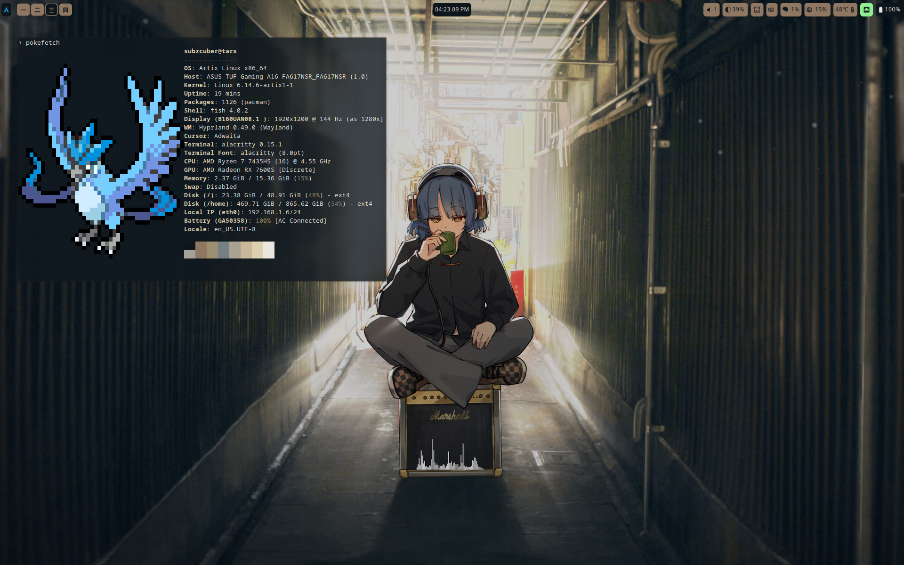
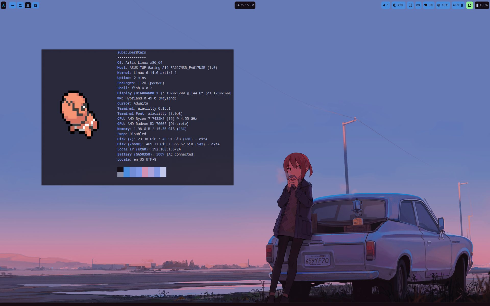
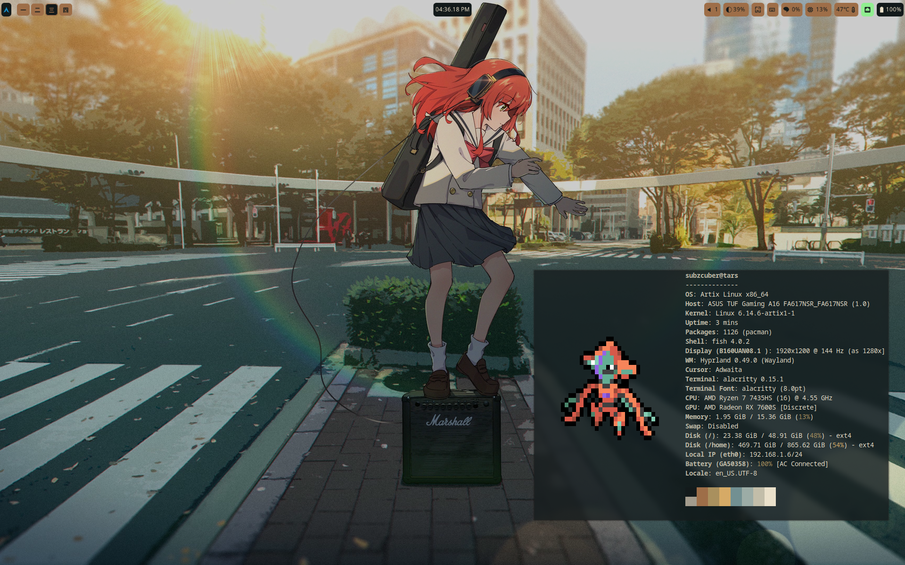
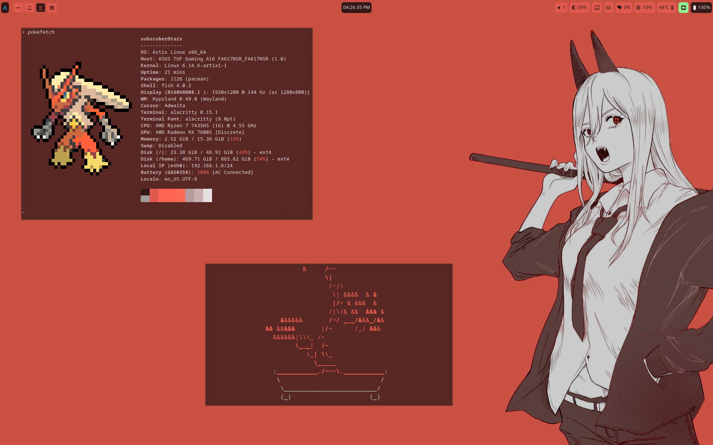

# Dots



## What do I use?

- [Hyprland](https://hyprland.org) - Window Manager
- [Hyprlock](https://github.com/https://wiki.hyprland.org/Hypr-Ecosystem/hyprlock/) - Lock Screen
- [swww](https://github.com/https://wiki.hyprland.org/Hypr-Ecosystem/hyprlock/) - Wallpaper Manager
- [Waybar](https://github.com/Alexays/Waybar) - Status Bar
- [Pipewire](https://wiki.archlinux.org/title/PipeWire) - Audio stuff
- [Alacritty](https://alacritty.org/) - Terminal Emulator
- [Clipse](https://github.com/savedra1/clipse) - Clipboard Manager
- [Fish](https://fishshell.com/) - Shell
- [Pywal](https://github.com/dylanaraps/pywal) - Dynamic Colors
- [Neovim](https://neovim.io/) - Text Editor with AstroVim configs
- [NNN](https://github.com/jarun/nnn) - File Manager
- [Rofi(wayland fork)](https://github.com/lbonn/rofi) - App Launcher
- [Grimblast](https://github.com/hyprwm/contrib#grimblast) and [swappy](https://github.com/jtheoof/swappy) - For taking and editing screenshots
- [NetworkManager](https://wiki.archlinux.org/title/NetworkManager) and [nmtui](https://linuxcommandlibrary.com/man/nmtui) - Network stuff
- [Kew](https://github.com/ravachol/kew) - Music

## System

- Laptop: Asus TUF A16 2023
- dGPU: AMD Radeon RX 7600S
- CPU: AMD Ryzen 7 7435HS
- OS: Artix Linux
    - Kernel: `linux`
    - Bootloader: `GRUB2`
    - Init: `runit`
    - No display manager

## Installation/Use

On a fresh arch/artix linux install, or any os really

1. (if arch based) setup yay, could do this manually or just run the [yay-setup.sh](./.config/my-scripts/yay-setup.sh) script
1. Install the necessary packages from the package lists in [my-lists](/.config/my-lists/). You can do this with 
    ```sh
    pacman -S - < pacman-pkg-list.txt
    yay -S - < yay-pkg-list.txt
    ```
1. Once you have your packages, you need their configs to be in the right place, for that first delete/move your old `.config` directory, then create a symlink from this one to the new one
    ```sh
    mv ~/.config/ ~/.config.bak # or you can do rm -rf ~/.config
    ln -s ~/dots/.config ~/.config
    ```
1. Next deal with your errors as they come up, check out the scripts in [my-scripts](./.config/my-scripts/), you will probably need to run a few of them

Check out hyprland keybinds [here](./.config/my-lists/keybinds.md), that will definitely be useful

## Showcase

My wallpapers can be found [here](https://github.com/Majestic9169/wallpapers) (there are a lot)







